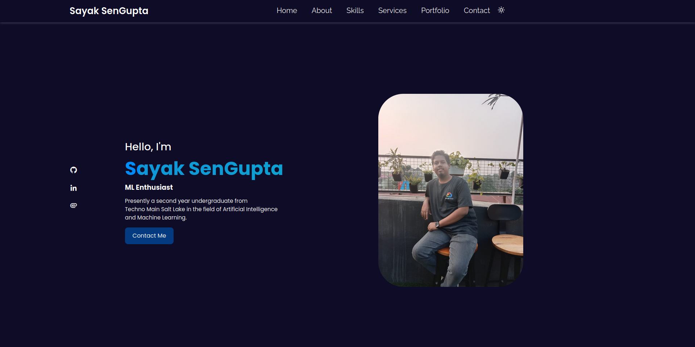

<h1 align="center">Hi 👋, I'm Sayak SenGupta</h1>
<h3 align="center">A Passionate Web Developer from Kolkata, West Bengal</h3>

- 🌱 I’m currently learning **Data Structures, Advanced Python, Database Connectivity, Front End Development and many more such amazing topics!**

- 👨‍💻 All of my projects are available at [https://github.com/LoNeWoLf003](https://github.com/LoNeWoLf003)

- 💬 Ask me about **C, HTML, CSS, JavaScript, C++**

- 📫 How to reach me **sayaksengupta2110@gmail.com**

- ⚡ Fun fact **I have been training in Indian Classical Music for 14 years!**

-  💁‍♂️ Wanna see more about me ? Click -> https://lonewolf003.github.io/portfolio/

<h3 align="left">Connect with me:</h3>

<h3 align="left">Languages and Tools:</h3>

          

   
   <a href="https://github.com/LoNeWoLf003">
   
    
   </a>

### Statistics :  

 

